

  

<h1 align="center">
🚀 OneBitFoodProgLima 🚀
</h1>

  

  

  

  

  

  <a href="#-projeto">Projeto</a>&nbsp;&nbsp;&nbsp;|&nbsp;&nbsp;&nbsp;
  <a href="#rocket-tecnologias">Tecnologias</a>&nbsp;&nbsp;&nbsp;|&nbsp;&nbsp;&nbsp;
    <a href="#rocket-aprendizado">Aprendizado</a>&nbsp;&nbsp;&nbsp;|&nbsp;&nbsp;&nbsp;
  <a href="#rocket-layout">Layout</a>&nbsp;&nbsp;&nbsp;|&nbsp;&nbsp;&nbsp;
  <a href="#rocket-install-config-postgresql">Instalando e Configurando PostgreSQL</a>&nbsp;&nbsp;&nbsp;|&nbsp;&nbsp;&nbsp;
  <a href="#rocket-backend">Backend</a>&nbsp;&nbsp;&nbsp;|&nbsp;&nbsp;&nbsp;
  <a href="#rocket-frontend">Frontend</a>&nbsp;&nbsp;&nbsp;|&nbsp;&nbsp;&nbsp;
  <a href="#memo-licença">Licença</a>

 

## 💻 Projeto

Esse projeto foi desenvolvido com o objetivo de me atualizar com a nova versão do Rails 6 e Reactjs usando o Nextjs.

Neste projeto, encontrasse uma API feita em Ruby on Rails 6 e a parte Web feita em Nextjs.

https://onebitfood-web.vercel.app/

## :rocket: Tecnologias

Esse projeto foi desenvolvido com as seguintes tecnologias:

- [Ruby](https://www.ruby-lang.org/pt/)
- [Rails](https://rubyonrails.org/)
- [PostgreSQL](https://www.postgresql.org/)
- [Reactjs](https://pt-br.reactjs.org/)
- [Nextjs](https://nextjs.org/)
- [React-Bootstrap](https://react-bootstrap.github.io/)

\* Para mais detalhes, veja o **[Gemfile](./Backend/GemFile)**
OU
\* Para mais detalhes, veja o **[package.json](./frontend/package.json)**

## :school_satchel: Aprendizados
### Backend
- Atualização das features do Rails 6
- O uso da Gem jbuilder e como criar Partials
- Versionsamento de API no Rails 6

### Frontend
- Reactjs + Nextjs
- Como usar bootstrap em projeto React
- Lib react-slick

## 🎨 Layout
### Diagrama do DB
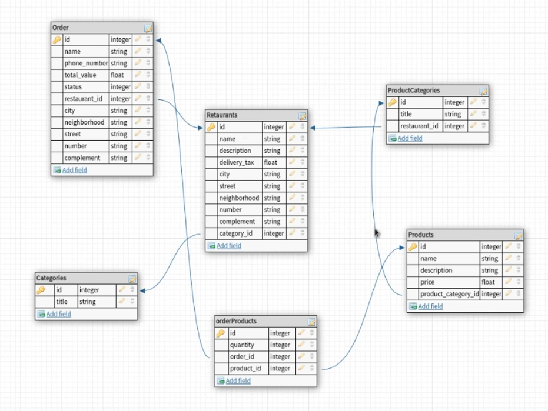

### Web

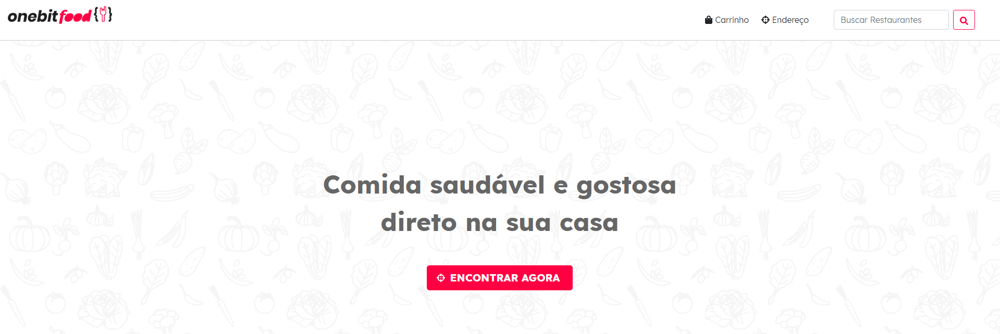

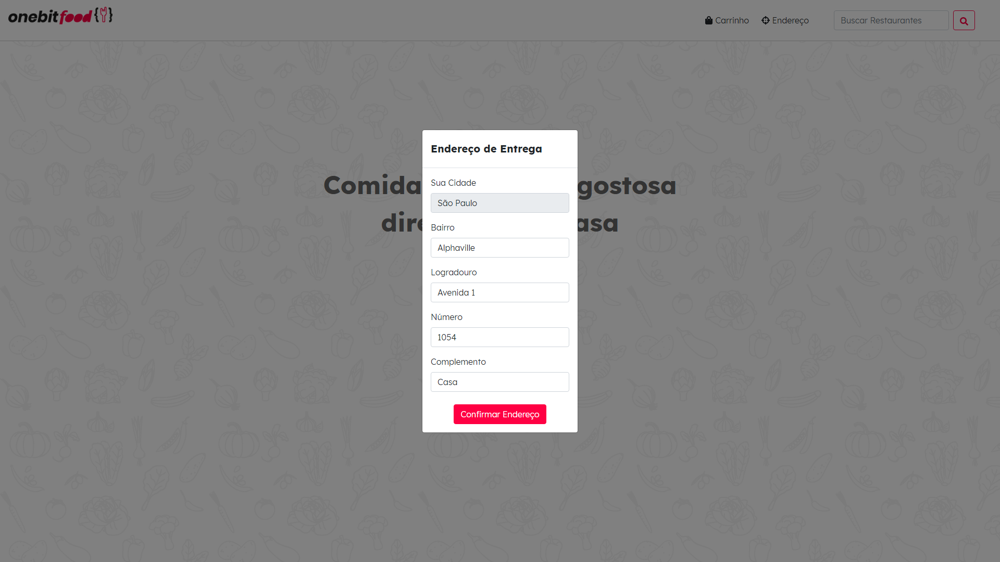

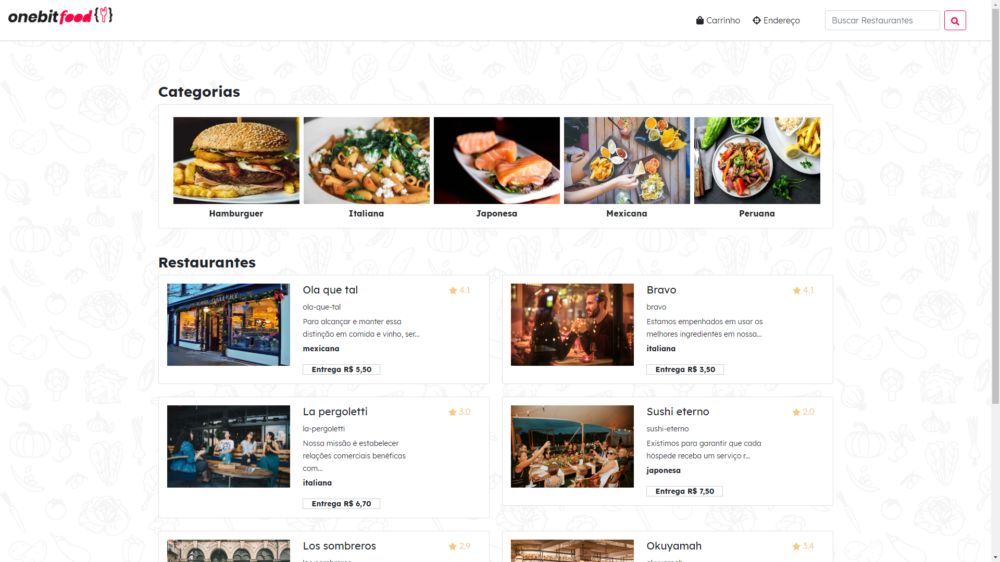

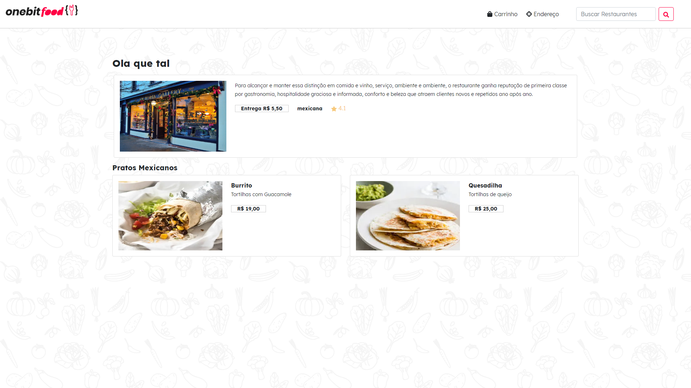

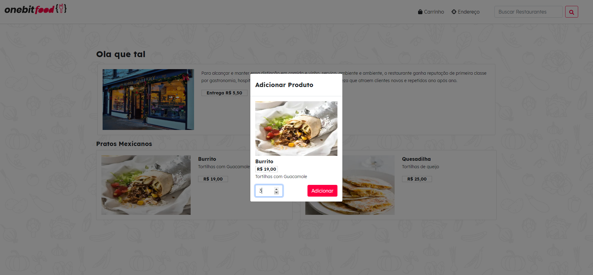

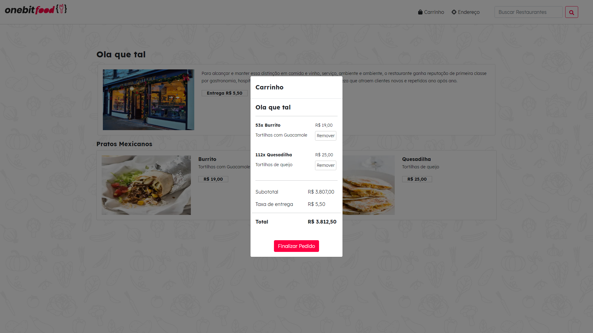

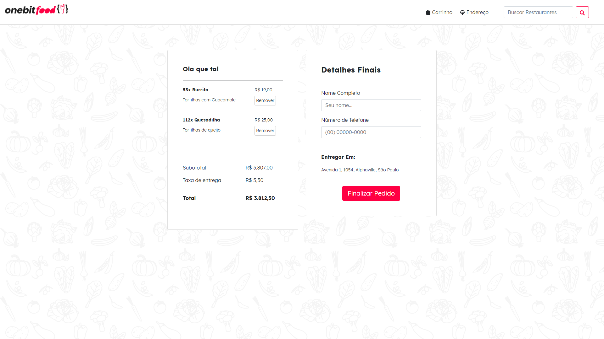

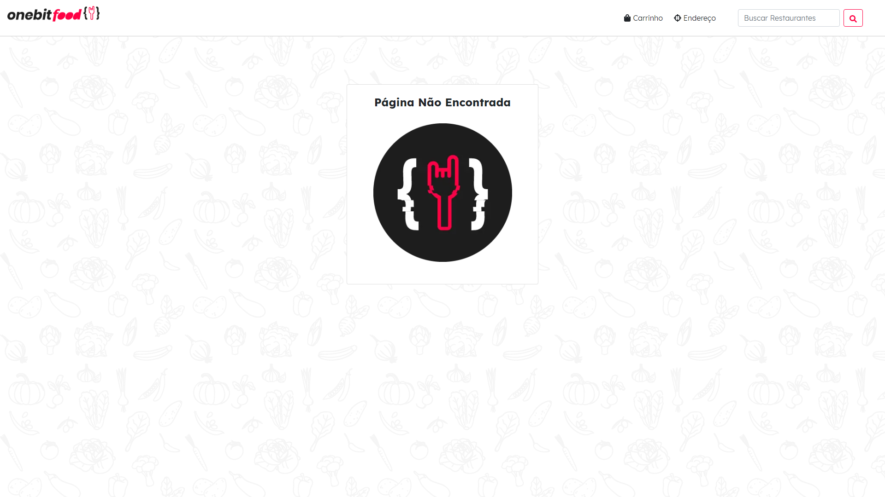

### Mobile

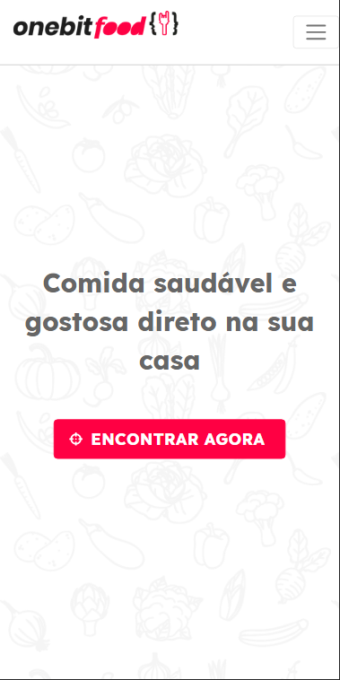

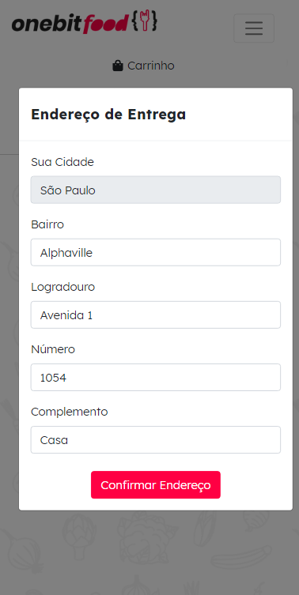

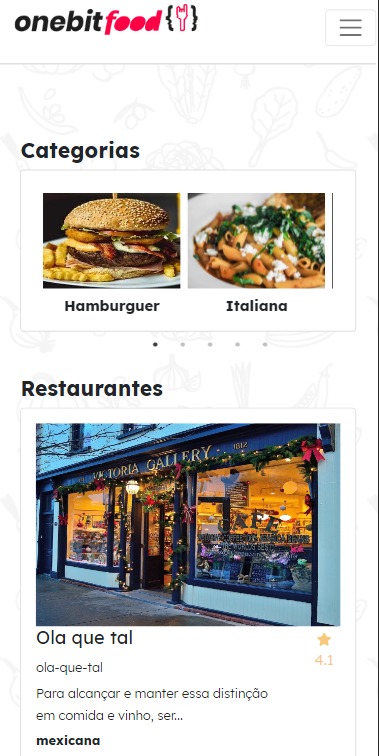

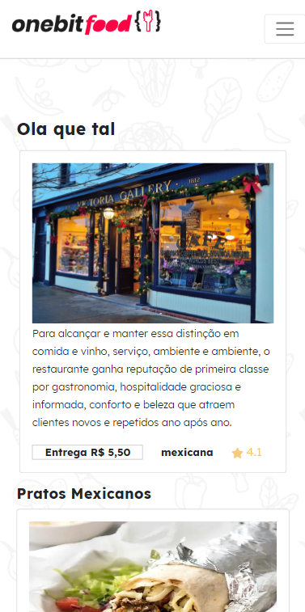

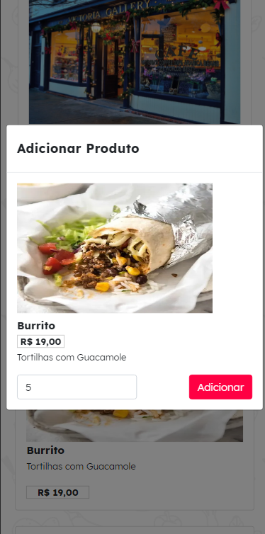

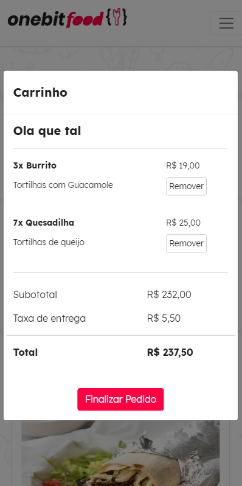

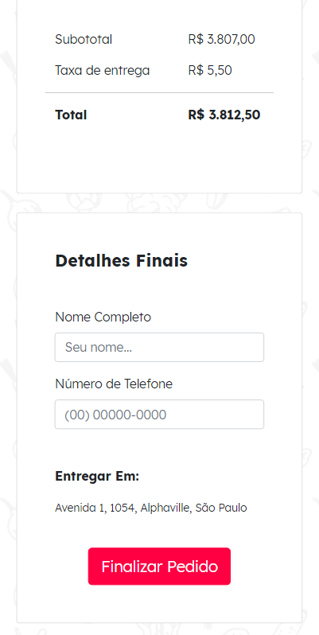

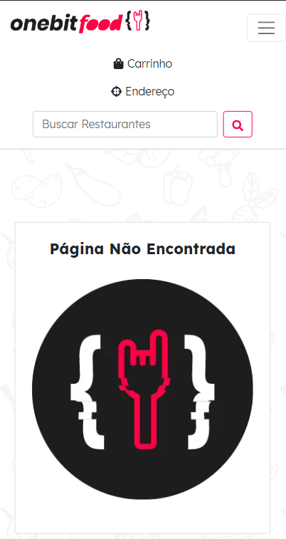

## :notebook: Backend
[Projeto Backend](./Backend/README.md)

[Documentação da API](https://documenter.getpostman.com/view/2433434/TzeTKpyN)
## :notebook: Frontend
[Projeto Frontend](./frontend/README.md)

Feito com ❤️ por Douglas Lima </h2> [Entre em contato!](https://www.linkedin.com/in/douglasproglima)